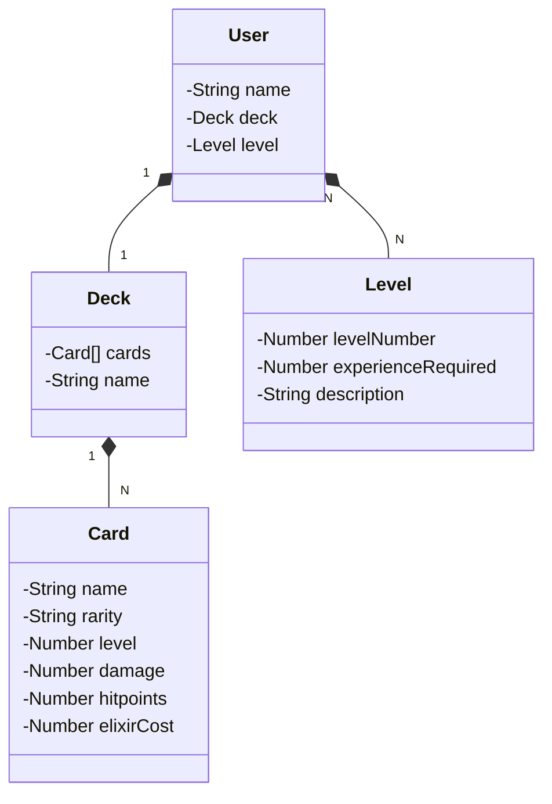

# API CLash Royale

## Diagrama de Classes



# Example JSON
```
{
  "name": "JogadorPro",
  "level": {
    "levelNumber": 5,
    "experienceRequired": 1000,
    "description": "Guerreiro Mestre"
  },
  "deck": {
    "name": "Deck Principal",
    "cards": [
      {
        "name": "Arqueira",
        "rarity": "Comum",
        "level": 8,
        "damage": 100,
        "hitpoints": 300,
        "elixirCost": 3
      },
      {
        "name": "Gigante",
        "rarity": "Raro",
        "level": 5,
        "damage": 250,
        "hitpoints": 2000,
        "elixirCost": 5
      },
      {
        "name": "Príncipe",
        "rarity": "Épico",
        "level": 4,
        "damage": 300,
        "hitpoints": 1500,
        "elixirCost": 5
      }
    ]
  }
}
```
